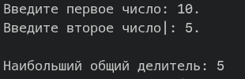
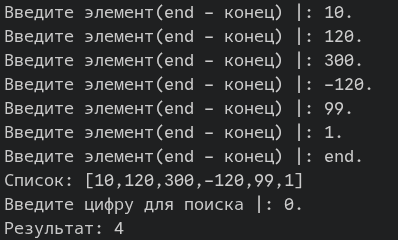
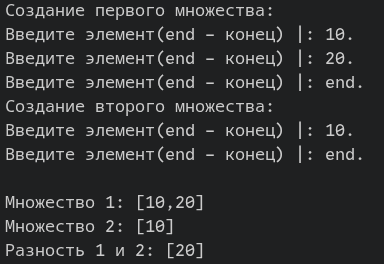
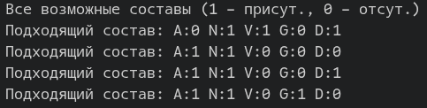

# Сурков Яков КМБ-1 Лабораторная №5

# Задание 1. Рекурсия
## Задача 4
### Текст задачи
Составить программу вычисления наибольшего общего делителя двух натуральных чисел.

### Описание логики работы
В программе пользователю предлагается по очереди ввести два натуральных числа. 

Далее программа использует рекурсивный алгоритм для вычисления НОД: она находит остаток от деления первого числа на второе, а затем рекурсивно вызывает сама себя, передавая на место первого аргумента второе число, а на место второго — полученный остаток. 

Этот процесс повторяется до тех пор, пока второе число не станет равным нулю. Базовое условие рекурсии срабатывает, когда остаток равен нулю — тогда текущее первое число признается наибольшим общим делителем. В итоге программа выводит найденный результат на экран.

### Тестирование

# Задание 2. Списки
## Задача 4
### Текст задачи
В списке натуральных чисел подсчитать их количество, оканчивающихся заданной цифрой.

### Описание логики работы
В программе пользователю предлагается поочередно вводить элементы с клавиатуры для формирования списка. Ввод элементов продолжается до тех пор, пока пользователь не введет команду `end`. Получившийся список выводится на экран.

Далее программа просит пользователя ввести цифру для поиска. 

Затем программа рекурсивно проходит по всем элементам сформированного списка, проверяя каждое число: берёт его по модулю и вычисляет остаток от деления на 10. 
  - если остаток совпадает с заданной цифрой, счетчик совпадений увеличивается на единицу;
  - иначе, число игнорируется, и программа переходит к следующему.

В завершение на экран выводится итоговое количество чисел, оканчивающихся на искомую цифру.

### Тестирование

# Задание 3. Решить задачу на обработку списка
## Задача 4
### Текст задачи
Определим множество как список без повторяющихся элементов. Найти разность множеств.

### Описание логики работы
В программе пользователю предлагается поочередно вводить элементы с клавиатуры для формирования первого множества. Ввод продолжается до тех пор, пока не будет введена команда end. После этого аналогичным образом создается второе множество.

Далее программа вычисляет разность этих множеств, рекурсивно проходя по всем элементам первого списка и проверяя их наличие во втором:
  - если текущий элемент из первого множества присутствует во втором, он игнорируется;
  - иначе, этот элемент сохраняется и добавляется в результирующий список.

В завершение на экран выводятся оба исходных множества, а также итоговый список, представляющий собой их разность (элементы, которые есть в первом множестве, но отсутствуют во втором).

### Тестирование

# Задание 4. Решить задачу на обработку списка
## Задача 4
### Текст задачи
Задача «Пятеро друзей».
Пятеро друзей решили записаться в кружок любителей логических задач: Андрей (А), Николай (N), Виктор (V), Григорий (G), Дмитрий (D). Но староста кружка поставил им ряд условий: «Вы должны приходить к нам так, чтобы:
1) если А приходит вместе с D, то N должен присутствовать обязательно;
2) если D отсутствует, то N должен быть, а V пусть не приходит;
3) А и V не могут одновременно ни присутствовать, ни отсутствовать;
4) если придет D, то G пусть не приходит;
5) если N отсутствует, то D должен присутствовать, но это в том случае, если не
присутствует V;
6) если же и V присутствует при отсутствии N, то D приходить не должен, a G должен прийти».
В каком составе друзья смогут прийти на занятия кружка?

### Описание логики работы
В программе задается база возможных состояний для переменных — 0 (отсутствует) и 1 (присутствует). 

Далее программа перебирает все возможные комбинации для пяти переменных (A, N, V, G, D) и прогоняет их через блок условий. 

В итоге программа находит комбинацию, которая удовлетворяет всем заявленным правилам, и выводит результат на экран в формате `Переменная:Значение`, где 1 означает присутствие, а 0 — отсутствие.

### Тестирование
